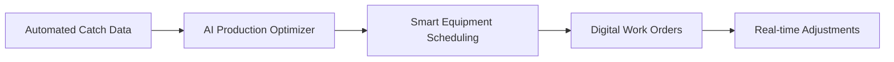
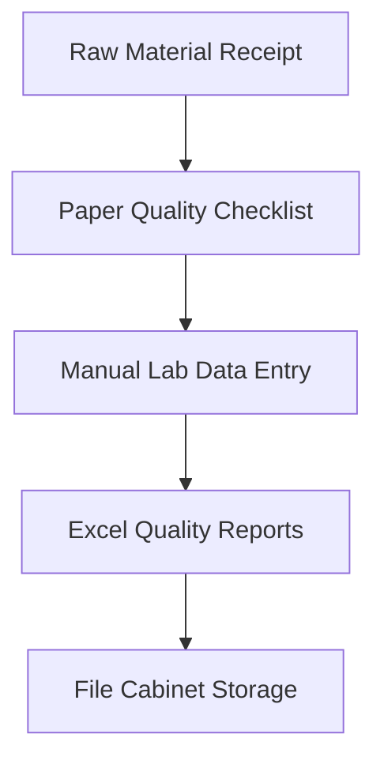
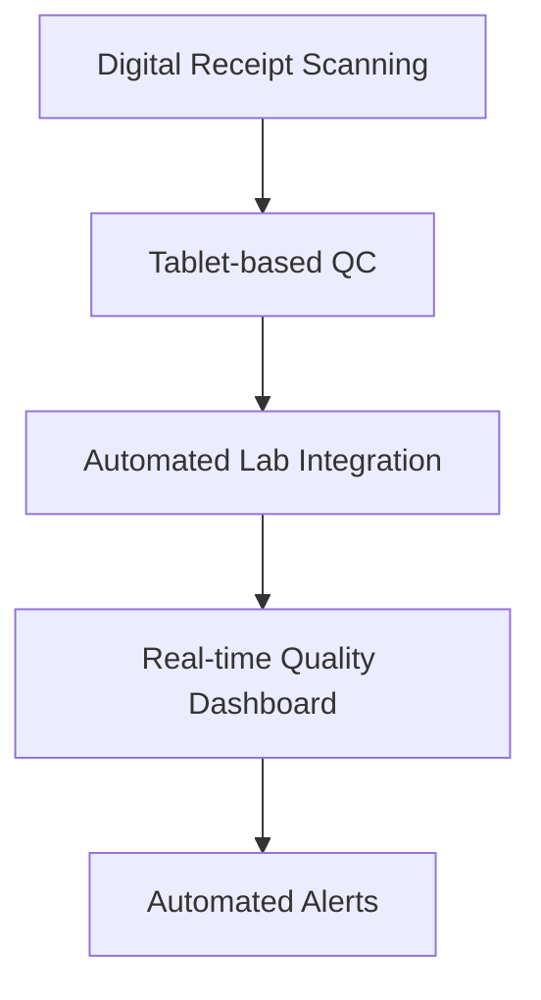

# Process Analysis
## Baikal Fish Processing Plant - Current vs Future State

## Core Business Processes

### 1. Production Planning Process

#### Current State (As-Is)

## Pain Points:

4-6 hours daily for production planning

No integration with real-time inventory data

Seasonal catch fluctuations not systematically handled

Equipment conflicts and downtime

## Future State (To-Be)

## Improvements:

Planning time: 4hr → 30min (88% reduction)

Equipment utilization: +25%

Production yield: +8%

### 2. Quality Control Process
## Current State

## Pain Points:

15% data entry errors in quality records

2-day delay in quality trend analysis

No real-time quality alerts

Difficult batch traceability

## Future State

## Improvements:

Quality data accuracy: 85% → 99.5%

Reporting time: 2 days → real-time

Batch traceability: 100% coverage

3. Inventory Management Process
## Current State

## Pain Points:

12% inventory discrepancies

8 hours weekly for stock counting

No real-time visibility

Production delays due to stockouts

## Future State

## Improvements:

Inventory accuracy: 88% → 99%

Counting time: 8hr → 1hr (88% reduction)

Stockout reduction: 90%

# Process Metrics Comparison
## Production Planning
Metric	Current	Target	Improvement
Planning Time	4 hours	30 min	88%
Schedule Accuracy	65%	92%	42%
Equipment Utilization	68%	85%	25%
## Quality Control
Metric	Current	Target	Improvement
Data Entry Accuracy	85%	99.5%	17%
Reporting Time	2 days	real-time	100%
Batch Traceability	60%	100%	67%
## Inventory Management
Metric	Current	Target	Improvement
Inventory Accuracy	88%	99%	13%
Counting Time	8 hours	1 hour	88%
Stockout Frequency	12/month	2/month	83%
## Integration Points
## Data Flow Architecture
text
Catch Data → Production Planner → Quality System → Inventory → Reporting
    ↓           ↓               ↓           ↓          ↓
Real-time → Optimization → Compliance → Tracking → Analytics

## System Dependencies
Production Planning: Requires real-time inventory and equipment status

Quality Management: Needs laboratory equipment integration

Inventory Tracking: Depends on barcode scanning infrastructure

Reporting: Integrates all data sources for comprehensive analytics

# Process Automation Opportunities
## High Priority (0-3 months)
Digital Production Scheduling - Replace Excel planning

Barcode Inventory System - Eliminate manual counting

Tablet-based Quality Checks - Remove paper forms

## Medium Priority (3-6 months)
Automated Yield Calculation - Real-time production efficiency

Predictive Maintenance - Equipment downtime reduction

Supplier Integration - Raw material quality tracking

## Long-term (6-12 months)
AI Demand Forecasting - Production optimization

Advanced Analytics - Process improvement insights

Mobile Operations - Real-time decision support

## Success Metrics
Operational Efficiency
Overall Equipment Effectiveness: 65% → 82%

Production Yield: 72% → 80%

Labor Productivity: +35%

## Quality Improvement
Customer Returns: 3.2% → 0.8%

Regulatory Compliance: 100% maintained

Quality Cost Reduction: 28% → 15%

## Financial Impact
ROI: 145% within 18 months

Operating Cost Reduction: 22%

Inventory Carrying Cost: 18% reduction
