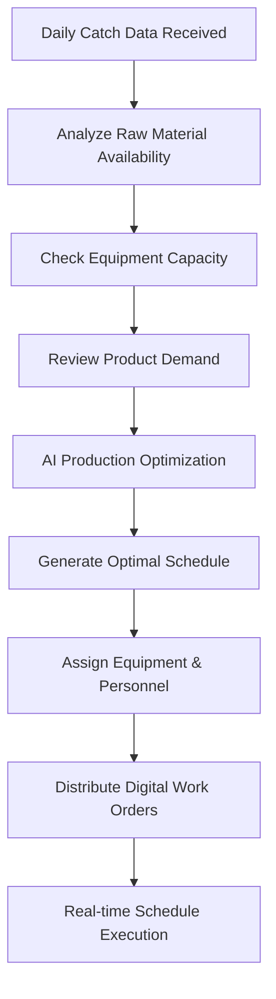
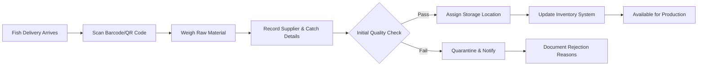
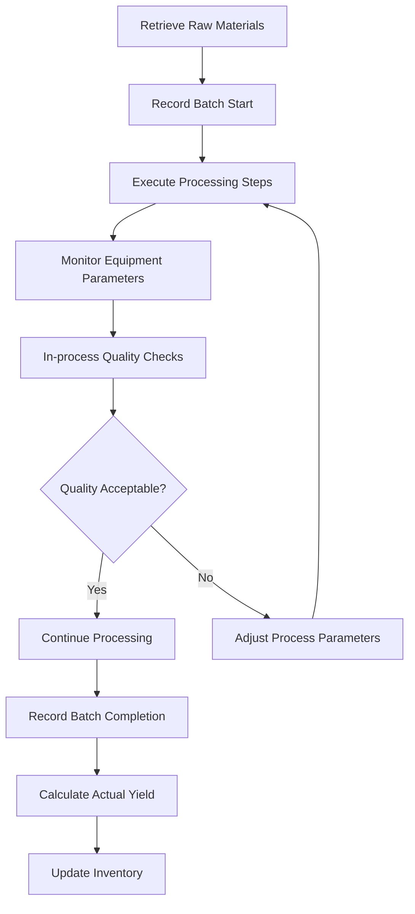
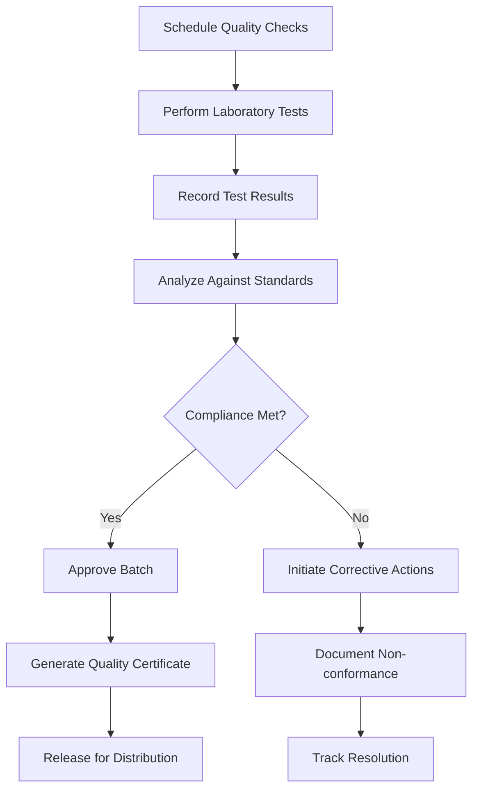
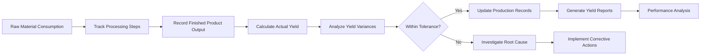
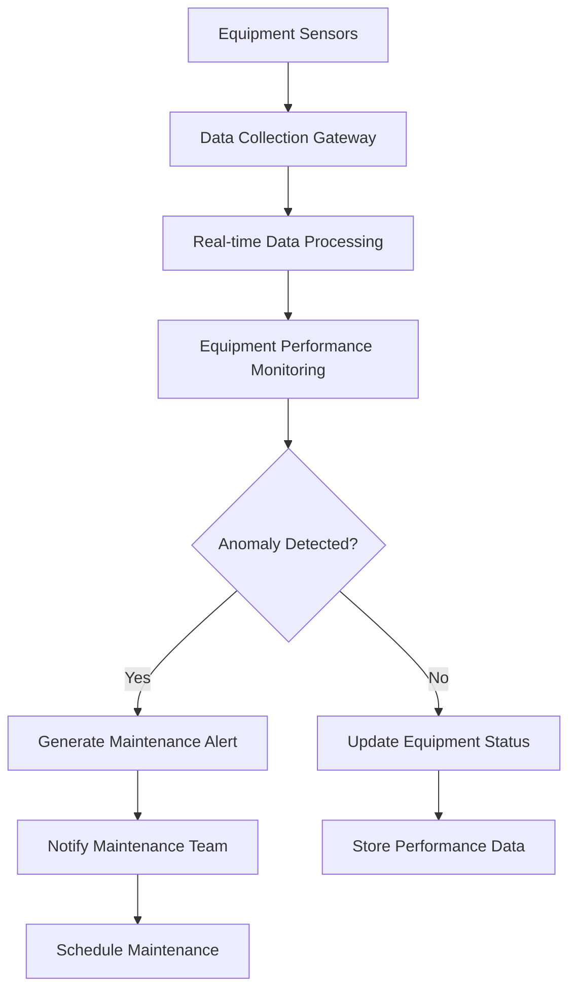
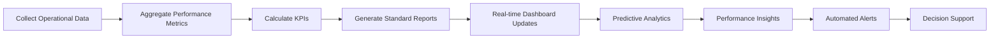
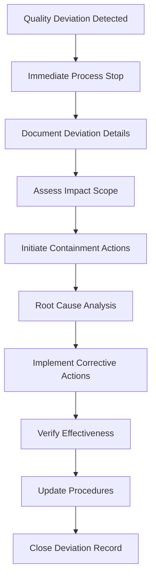
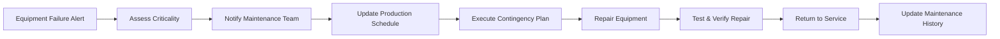

# Process Flows
## Baikal Fish Processing Plant Digital Transformation

## Core Business Process Flows

### 1. Production Planning & Scheduling Flow

### Key Decision Points:

Equipment availability and maintenance status

Raw material quality and shelf life

Personnel skill matching

Product priority and customer requirements

### 2. Raw Material Receiving & Quality Check Flow

### Quality Check Parameters:

Appearance and color

Smell and freshness

Temperature history

Supplier certification

### 3. Production Execution & Monitoring Flow

### Real-time Monitoring:

Equipment temperature and pressure

Processing time adherence

Quality parameter tracking

Yield calculation

### 4. Quality Management & Compliance Flow

### Compliance Standards:

Food safety regulations

Customer specifications

Internal quality standards

Certification requirements

### 5. Inventory Management & Yield Calculation Flow

### Yield Calculation Formula:

text
Yield % = (Finished Product Weight / Raw Material Weight) × 100
Expected vs Actual Variance Analysis
System Integration Flows
### 6. Equipment Data Integration Flow

### Integrated Equipment:

Weighing scales

Temperature sensors

Processing equipment

Laboratory analyzers

### 7. Reporting & Analytics Flow

### Key Performance Indicators:

Overall Equipment Effectiveness (OEE)

First Pass Yield

Schedule Adherence

Quality Compliance Rate

Exception Handling Flows
### 8. Quality Deviation Handling Flow

### 9. Equipment Failure Response Flow

Data Flow Architecture
### 10. End-to-End Data Flow
text
Raw Material Data → Inventory System → Production Planning → Quality System
       ↓                   ↓                  ↓                 ↓
Supplier Info     →   Stock Levels   →   Batch Records  →  Test Results
       ↓                   ↓                  ↓                 ↓
Quality History    →  Consumption Data → Yield Calculation → Compliance
       ↓                   ↓                  ↓                 ↓
Analytics Engine   →  Performance DB  →  Reporting System → Certificates

### Process Performance Metrics

### Production Planning Metrics
Schedule Accuracy: 95% target

Planning Time Reduction: 4hr → 30min (88%)

Equipment Utilization: 65% → 85% target

### Quality Management Metrics
First Pass Yield: 92% target

Quality Data Accuracy: 99.5% target

Compliance Rate: 100% maintained

### Inventory Management Metrics
Inventory Accuracy: 99% target

Stockout Reduction: 83% improvement

Yield Improvement: 72% → 80% target

### Process Automation Levels

### Fully Automated Processes
Production schedule generation

Quality test data collection

Inventory tracking and updates

Performance reporting

### Semi-Automated Processes
Quality decision making 

Exception handling

Maintenance scheduling

Supplier communication

### Manual Processes (Phase 1)
Initial quality assessments

Complex problem resolution

Strategic decision making

Customer relationship management

