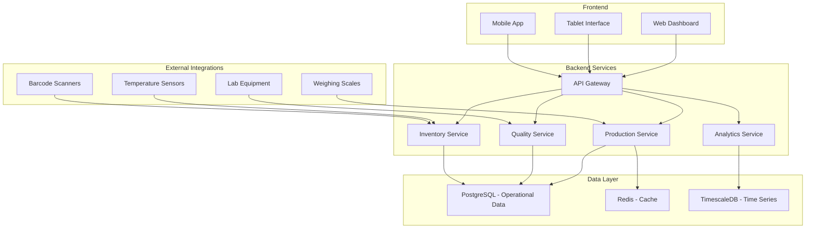

 System Architecture
## Baikal Fish Processing Plant Digital Transformation

## High-Level Architecture Overview

  
## Microservices Architecture
## 1. Production Service
Purpose: Production planning, scheduling, and optimization
Responsibilities:

Generate optimal production schedules

Monitor equipment utilization

Track production progress

Calculate production efficiency

## Key Endpoints:

POST /api/production/schedules     # Generate production schedule
GET  /api/production/progress      # Real-time production tracking
GET  /api/production/efficiency    # Equipment utilization metrics
## 2. Quality Service
Purpose: Quality control management and compliance tracking
Responsibilities:

Manage quality check procedures

Track laboratory test results

Monitor compliance thresholds

Generate quality certificates

## Key Endpoints:

text
POST /api/quality/checks           # Record quality inspection
GET  /api/quality/compliance       # Check compliance status
POST /api/quality/certificates     # Generate quality certificates
## 3. Inventory Service
Purpose: Raw material and finished goods inventory management
Responsibilities:

Track inventory movements

Calculate production yields

Monitor shelf life and freshness

Manage stock levels

## Key Endpoints:

text
POST /api/inventory/receipts       # Record raw material receipt
GET  /api/inventory/levels         # Current inventory status
POST /api/inventory/yields         # Calculate production yields
## 4. Analytics Service
Purpose: Business intelligence and reporting
## Responsibilities:

Generate operational reports

Provide real-time dashboards

Perform predictive analytics

Track KPIs and metrics

## Key Endpoints:

text
GET  /api/analytics/dashboard      # Real-time dashboard data
GET  /api/analytics/reports        # Generate operational reports
POST /api/analytics/predictions    # Production forecasts
Data Models
Core Entities
## Production Batch
json
{
  "batch_id": "BATCH-2024-001",
  "product_type": "SMOKED_OMUL",
  "planned_quantity": 500,
  "actual_quantity": 485,
  "start_time": "2024-01-15T08:00:00Z",
  "end_time": "2024-01-15T16:30:00Z",
  "equipment_used": ["SMOKER-01", "PACKAGING-02"],
  "status": "COMPLETED",
  "yield_percentage": 97.0
}
## Quality Inspection
json
{
  "inspection_id": "QC-2024-001",
  "batch_id": "BATCH-2024-001",
  "inspector_id": "QC-001",
  "inspection_date": "2024-01-15T14:00:00Z",
  "parameters": {
    "appearance_score": 9,
    "texture_score": 8,
    "smell_score": 10,
    "bacterial_count": 1000
  },
  "status": "PASSED",
  "comments": "Excellent quality batch"
}
## Inventory Item
json
{
  "item_id": "RAW-OMUL-001",
  "item_type": "RAW_MATERIAL",
  "quantity": 1500,
  "unit": "kg",
  "received_date": "2024-01-15T06:00:00Z",
  "expiry_date": "2024-01-17T18:00:00Z",
  "storage_temperature": -2.5,
  "supplier_id": "FISHER-001",
  "location": "COLD-ROOM-A"
}
## Integration Architecture
## Equipment Integration Layer
python
class EquipmentIntegration:
    def connect_weighing_scale(self, scale_id):
        # Real-time weight data capture
        pass
    
    def integrate_lab_equipment(self, equipment_id):
        # Automated test result collection
        pass
    
    def monitor_temperature_sensors(self, sensor_network):
        # Continuous temperature monitoring
        pass
## Data Flow
text
Raw Material Receipt → Quality Check → Production Planning → Processing
     ↓                      ↓               ↓               ↓
Inventory Update   → Quality Records → Schedule Execution → Yield Calculation
     ↓                      ↓               ↓               ↓
Stock Management    → Compliance Check → Progress Tracking → Finished Goods
## Security Architecture
## Authentication & Authorization
yaml
authentication:
  method: "JWT with RSA256"
  token_expiry: "24 hours"
  refresh_tokens: true

## authorization:
  roles:
    - "production_manager: full_production_access"
    - "quality_inspector: quality_management"
    - "inventory_clerk: inventory_operations"
    - "maintenance: equipment_access"
## Data Protection
Encryption: AES-256 for data at rest, TLS 1.3 for data in transit

Access Control: Role-based permissions with audit trails

Backup: Daily automated backups with 30-day retention

## Deployment Architecture
## Infrastructure Requirements
yaml
compute:
  api_servers: "4 vCPU, 8GB RAM"
  database_servers: "8 vCPU, 16GB RAM"
  cache_servers: "2 vCPU, 4GB RAM"

## storage:
  database: "500GB SSD"
  backups: "1TB object storage"
  file_storage: "200GB for documents"

## networking:
  bandwidth: "100 Mbps dedicated"
  latency: "< 50ms internal"
  vpn: "Site-to-site for remote locations"
## Monitoring & Alerting
python
monitoring_config = {
    "application_metrics": [
        "response_times",
        "error_rates",
        "throughput",
        "equipment_uptime"
    ],
    "business_metrics": [
        "production_yield",
        "quality_compliance",
        "inventory_accuracy",
        "equipment_utilization"
    ]
}
## Technology Stack
## Backend
Language: Python 3.9+

Framework: FastAPI

Database: PostgreSQL 14

Cache: Redis 7

Message Queue: Redis with RQ

## Frontend
Framework: React 18

State Management: Redux Toolkit

Charts: Chart.js

Mobile: React Native

## Infrastructure
Containerization: Docker

Orchestration: Docker Compose

Monitoring: Prometheus + Grafana

Logging: ELK Stack

# Scalability Considerations
## Horizontal Scaling
Stateless API services for easy replication

Database read replicas for reporting

Cached frequently accessed data

## Performance Optimization
Database indexing for frequent queries

Query optimization for large datasets

Background processing for heavy computations

## Disaster Recovery
Multi-zone deployment for high availability

Automated failover procedures

Regular disaster recovery testing

