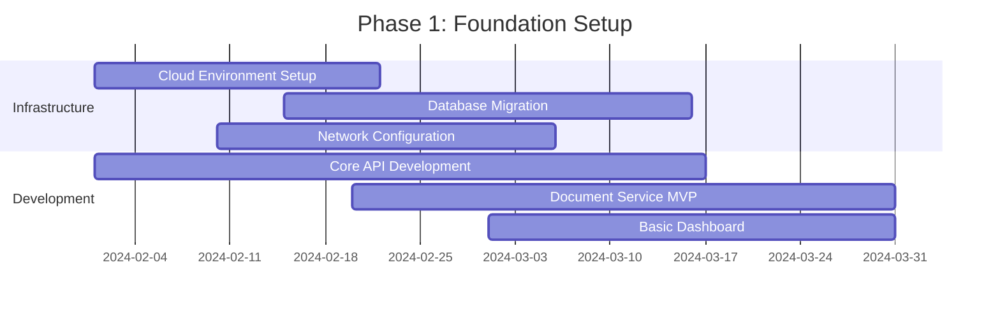
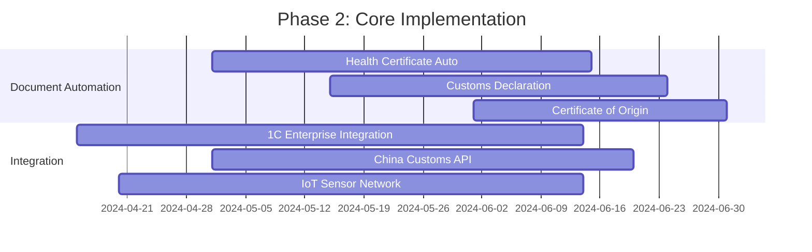

# Implementation Guide
## AI BuryatMyasoprom Digital Transformation

### Project Overview
Step-by-step implementation guide for deploying the AI-powered digital transformation platform at BuryatMyasoprom meat processing plant.

### Implementation Timeline

#### Phase 1: Foundation (Months 1-3)

Phase 2: Core Features (Months 4-6)

Pre-Implementation Checklist
1. Infrastructure Requirements
yaml
hardware:
  servers:
    - "API Server: 8 vCPU, 16GB RAM, 500GB SSD"
    - "Database Server: 16 vCPU, 32GB RAM, 1TB SSD"
    - "Cache Server: 4 vCPU, 8GB RAM, 100GB SSD"
  networking:
    - "Dedicated internet: 100 Mbps minimum"
    - "VPN for 1C integration"
    - "Firewall configuration"

software:
  operating_system: "Ubuntu 20.04 LTS"
  database: "PostgreSQL 14, Redis 7, MongoDB 6"
  runtime: "Python 3.9+, Node.js 18+"
  containerization: "Docker 20+, Docker Compose"
2. Data Migration Plan
python
data_migration_phases = {
    "phase_1_legacy_export": {
        "source": "1C:Enterprise export_orders",
        "target": "postgreSQL orders table",
        "estimated_records": 15000,
        "migration_time": "72 hours"
    },
    "phase_2_product_catalog": {
        "source": "1C:Enterprise products",
        "target": "postgreSQL products table", 
        "estimated_records": 5000,
        "migration_time": "48 hours"
    },
    "phase_3_customer_data": {
        "source": "1C:Enterprise customers",
        "target": "postgreSQL customers table",
        "estimated_records": 500,
        "migration_time": "24 hours"
    }
}
Step-by-Step Implementation
Step 1: Environment Setup
bash
# 1.1 Clone repository
git clone https://github.com/company/ai-buryatmyasoprom
cd ai-buryatmyasoprom

# 1.2 Setup Python environment
python -m venv venv
source venv/bin/activate  # Windows: venv\Scripts\activate
pip install -r requirements.txt

# 1.3 Database setup
sudo apt update
sudo apt install postgresql postgresql-contrib
sudo -u postgres createdb buryat_meat_export
sudo -u postgres createuser -P api_user

# 1.4 Configuration
cp config/.env.example config/.env
# Edit .env with database credentials and API keys
Step 2: Core Services Deployment
yaml
# docker-compose.yml
version: '3.8'
services:
  api:
    build: ./backend
    ports:
      - "8000:8000"
    environment:
      - DATABASE_URL=postgresql://user:pass@db:5432/buryat_meat_export
      - REDIS_URL=redis://redis:6379
    depends_on:
      - db
      - redis

  db:
    image: postgres:14
    environment:
      - POSTGRES_DB=buryat_meat_export
      - POSTGRES_USER=api_user
      - POSTGRES_PASSWORD=secure_password
    volumes:
      - postgres_data:/var/lib/postgresql/data

  redis:
    image: redis:7-alpine
    volumes:
      - redis_data:/data
Step 3: API Integration Configuration
python
# config/integrations.py
CHINA_CUSTOMS_CONFIG = {
    "base_url": "https://customs.china.gov/api/v1",
    "api_key": os.getenv("CHINA_CUSTOMS_API_KEY"),
    "timeout": 30,
    "retry_attempts": 3
}

ONE_C_ENTERPRISE_CONFIG = {
    "server_url": os.getenv("ONE_C_SERVER_URL"),
    "database_name": "BuryatMyasoprom",
    "username": os.getenv("ONE_C_USERNAME"),
    "password": os.getenv("ONE_C_PASSWORD")
}

IOT_SENSOR_CONFIG = {
    "mqtt_broker": os.getenv("MQTT_BROKER_URL"),
    "topic_prefix": "buryat/temperature/",
    "update_frequency": 60  # seconds
}
Testing & Validation
1. Unit Testing
python
# tests/test_document_generation.py
import pytest
from document_generator import CustomsDocumentGenerator

class TestDocumentGeneration:
    def test_health_certificate_generation(self):
        generator = CustomsDocumentGenerator()
        product_data = {
            "meat_type": "BEEF",
            "production_date": "2024-01-15",
            "quantity_kg": 5000
        }
        
        result = generator.generate_health_certificate(product_data)
        assert result["document_type"] == "Health_Certificate_China"
        assert result["validation_status"] == "COMPLETE"
    
    def test_temperature_compliance(self):
        compliance_engine = ComplianceEngine()
        sensor_data = [-17.5, -17.8, -18.1]
        
        result = compliance_engine.validate_temperature(sensor_data, "BEEF")
        assert result["compliant"] == True
        assert result["average_temperature"] == -17.8
2. Integration Testing
python
# tests/test_china_customs_integration.py
class TestChinaCustomsIntegration:
    @pytest.mark.integration
    async def test_document_submission(self):
        client = ChinaCustomsClient()
        test_documents = [{"type": "health_certificate", "content": {...}}]
        
        result = await client.submit_documents(test_documents)
        assert result["submission_id"] is not None
        assert result["status"] == "SUBMITTED"
User Training & Adoption
1. Training Schedule
python
training_plan = {
    "week_1_foundation": {
        "audience": "All export department staff",
        "topics": [
            "System overview and benefits",
            "Basic navigation and dashboard",
            "Order processing workflow"
        ],
        "duration": "4 hours",
        "format": "In-person workshop"
    },
    "week_2_advanced": {
        "audience": "Export managers, quality control",
        "topics": [
            "Document automation features",
            "Compliance monitoring",
            "Exception handling"
        ],
        "duration": "6 hours", 
        "format": "Hands-on lab"
    },
    "week_3_specialized": {
        "audience": "IT staff, administrators",
        "topics": [
            "System administration",
            "Troubleshooting guide",
            "API integration management"
        ],
        "duration": "8 hours",
        "format": "Technical deep dive"
    }
}
2. Change Management
yaml
change_management_phases:
  preparation:
    - "Stakeholder analysis completed"
    - "Communication plan developed"
    - "Training materials prepared"
  
  implementation: 
    - "Pilot group identified (3 export managers)"
    - "Gradual rollout to all users"
    - "Support desk established"
  
  reinforcement:
    - "Performance metrics tracking"
    - "User feedback collection"
    - "Continuous improvement process"
Go-Live Checklist
1. Pre-Launch Validation
python
go_live_checklist = {
    "infrastructure": [
        "All servers deployed and configured",
        "Database backups running",
        "Monitoring alerts active",
        "Disaster recovery tested"
    ],
    "functionality": [
        "Document generation tested with real data",
        "China Customs integration verified",
        "1C synchronization working",
        "User authentication functional"
    ],
    "business_processes": [
        "Export managers trained and ready",
        "Support procedures documented",
        "Escalation paths established",
        "Performance benchmarks set"
    ]
}
2. Rollback Plan
yaml
rollback_triggers:
  critical_issues:
    - "System downtime > 2 hours"
    - "Data corruption detected"
    - "Security breach identified"
    - "Critical business process failure"

rollback_procedure:
  step_1: "Notify all stakeholders immediately"
  step_2: "Revert to legacy systems temporarily"
  step_3: "Restore database from last backup"
  step_4: "Conduct post-mortem analysis"
  step_5: "Develop remediation plan"
Post-Implementation Support
1. Support Structure
python
support_model = {
    "level_1_support": {
        "team": "Internal IT staff",
        "scope": "User access, basic troubleshooting",
        "response_time": "2 business hours"
    },
    "level_2_support": {
        "team": "Development team", 
        "scope": "Technical issues, bug fixes",
        "response_time": "4 business hours"
    },
    "level_3_support": {
        "team": "Vendor/External experts",
        "scope": "Complex integrations, custom development",
        "response_time": "1 business day"
    }
}
2. Performance Monitoring
bash
# Monitor key metrics
# Application performance
curl -X GET "http://localhost:8000/health"

# Database performance  
psql -d buryat_meat_export -c "SELECT count(*) FROM orders;"

# System resources
docker stats
htop
Success Metrics Tracking
1. Implementation Success Criteria
python
success_metrics = {
    "technical": {
        "system_uptime": "> 99.5%",
        "response_time": "< 3 seconds dashboard",
        "error_rate": "< 1%"
    },
    "business": {
        "document_processing_time": "Reduced from 5 days to 8 hours",
        "compliance_rate": "Increased from 72% to 95%",
        "cost_per_shipment": "Reduced by 45%"
    },
    "user_adoption": {
        "active_users": "> 90% of target users",
        "feature_usage": "> 80% of available features",
        "user_satisfaction": "> 4.5/5 rating"
    }
}
Conclusion
This implementation guide provides a comprehensive roadmap for successful deployment of the AI BuryatMyasoprom digital transformation platform. Following this structured approach will ensure minimal disruption to operations while maximizing the benefits of automation and digitalization.

