# User Manual
## AI BuryatMyasoprom Digital Transformation Platform

### Getting Started

#### System Access
1. **Login URL**: https://platform.buryatmyasoprom.com
2. **Username**: Your employee ID (e.g., EMP2024001)
3. **Password**: Initial password provided by IT department

#### First Time Setup
Step 1: Login with temporary credentials
Step 2: Change password immediately
Step 3: Complete user profile
Step 4: Watch 5-minute orientation video
Step 5: Take interactive tutorial

text

### Dashboard Overview

#### Main Dashboard Components

```mermaid
%% Dashboard Layout – AI BuryatMyasoprom Control Center
graph TB
    subgraph Header [ ]
        H1[👤 User Info]:::header
        H2[🔔 Notifications]:::header
        H3[🚪 Logout]:::header
    end
    subgraph QuickActions [ ]
        QA1[➕ New Order]:::action
        QA2[📄 Generate Docs]:::action
        QA3[🚚 Track Shipment]:::action
    end
    subgraph Metrics [ ]
        M1[Orders Today<br/>147]:::good
        M2[Compliance Rate<br/>98.7%]:::good
        M3[Active Alerts<br/>2]:::warn
    end
    subgraph RecentOrders [ ]
        RO[Recent Orders<br/>→ Status │ Actions │ Timeline]:::table
    end
    subgraph Alerts [ ]
        A1[❄️ Temperature Deviation #1124]:::alert
        A2[📋 Missing Halal Cert #1109]:::alert
        A3[⏰ Expiry Date Warning #1130]:::warn
    end

    %% Layout
    Header --> QuickActions --> Metrics --> RecentOrders --> Alerts

    classDef header fill:#2d3748, color:#e2e8f0, stroke:#4a5568
    classDef action fill:#3182ce, color:#fff, stroke:#2c5282, font-weight:bold
    classDef good fill:#48bb78, color:#fff, stroke:#38a169
    classDef warn fill:#ed8936, color:#fff, stroke:#dd6b20
    classDef alert fill:#e53e3e, color:#fff, stroke:#c53030
    classDef table fill:#f7fafc, color:#2d3748, stroke:#e2e8f0, stroke-dasharray: 5 5
```

text

### Order Management

#### Creating New Export Order
1. **Click** "New Order" button
2. **Select** customer from database
3. **Add** products with quantities
4. **Configure** shipment details
5. **Review** and submit

**Example Order Form:**
Customer: China Meat Import Co. (CUST-CN-001)
Products:

Frozen Beef Carcass: 5,000 kg

Frozen Lamb Carcass: 2,000 kg
Shipment:

Port: Manzhouli

Transport: Refrigerated Truck

Departure: 2024-02-15
Documents Required: Auto-detected by system

text

#### Order Status Tracking
- **Draft**: Order being created
- **Processing**: Documents being generated
- **Compliance Check**: Automated validation
- **Ready for Shipment**: All documents approved
- **Shipped**: Goods dispatched
- **Delivered**: Confirmed arrival in China

### Document Automation

#### Automated Document Generation
The system automatically generates 25+ required documents:

**Key Documents:**
1. **Health Certificate** - Product safety compliance
2. **Customs Declaration** - Import/export declaration  
3. **Certificate of Origin** - Product origin verification
4. **Veterinary Certificate** - Animal health compliance
5. **Quality Inspection** - Product quality standards

#### Document Workflow
Order Created → Auto Document Detection → Template Selection →
AI Data Filling → Compliance Validation → Digital Signature →
China Customs Submission → Status Tracking

text

**Time Savings:**
- Manual process: 5 days
- Automated process: 8 hours
- Accuracy improvement: 85% to 99.9%

### Compliance Monitoring

#### Real-time Temperature Tracking
The system monitors cold chain integrity:

**Temperature Alerts:**
- **Warning**: Temperature approaches limits
- **Critical**: Temperature outside safe range
- **Emergency**: Equipment failure detected

**Response Procedures:**
1. **Receive alert** on dashboard and mobile
2. **Check** real-time temperature graph
3. **Contact** logistics team immediately
4. **Document** corrective actions in system

#### Regulation Compliance
- **Automatic updates** when China regulations change
- **Pre-submission validation** of all documents
- **Compliance score** for each shipment
- **Risk assessment** before shipment

### Quality Control

#### Batch Tracking
Each production batch receives unique QR code:

**Scanning Process:**
1. **Scan** QR code at production
2. **Record** quality inspection results
3. **Update** batch status in system
4. **Track** through entire supply chain

#### Quality Metrics
- **Temperature history** - Complete cold chain record
- **Inspection results** - All quality checks documented
- **Certification status** - Organic, Halal, etc.
- **Lab test results** - Microbiological and chemical tests

### Reporting & Analytics

#### Daily Reports
**Export Manager Dashboard:**
- Orders processed today
- Documents generated
- Compliance violations
- Shipment status updates

**Quality Control Reports:**
- Temperature compliance
- Quality inspection results
- Batch tracking status

#### Custom Reports
1. **Select** report type from templates
2. **Choose** date range and filters
3. **Add** custom metrics if needed
4. **Generate** and export report

### Mobile Access

#### Mobile App Features
- **Real-time alerts** for temperature violations
- **Document approval** on the go
- **Order status** updates
- **Quick actions** for urgent tasks

#### App Installation
1. **Download** from App Store/Google Play
2. **Login** with platform credentials
3. **Enable** push notifications
4. **Configure** quick actions

### Troubleshooting

#### Common Issues & Solutions

**Login Problems:**
- Issue: "Invalid credentials"
- Solution: Reset password using "Forgot Password"

**Document Generation Errors:**
- Issue: "Missing product information"
- Solution: Check product data completeness

**Temperature Alerts:**
- Issue: False temperature readings
- Solution: Verify sensor calibration

**System Performance:**
- Issue: Slow document generation
- Solution: Check internet connection

#### Support Contacts
- **IT Support**: +7 (3012) 123-456 (24/7)
- **Export Department**: Internal extension 205
- **Quality Control**: Internal extension 308
- **Emergency**: Platform administrator

### Best Practices

#### Order Management
1. **Create orders** at least 3 days before shipment
2. **Verify customer data** before order submission
3. **Review auto-generated documents** before submission
4. **Monitor order status** daily

#### Compliance Management
1. **Check compliance alerts** immediately
2. **Respond to temperature violations** within 1 hour
3. **Review regulation updates** weekly
4. **Validate all documents** before China submission

#### Data Quality
1. **Keep product catalog** updated
2. **Maintain customer information** accuracy
3. **Record all quality inspections** promptly
4. **Archive completed orders** properly

### Training Resources

#### Video Tutorials
1. **System Overview** (10 minutes)
2. **Order Creation** (15 minutes)
3. **Document Management** (20 minutes)
4. **Compliance Monitoring** (15 minutes)
5. **Reporting** (10 minutes)

#### Quick Reference Guides
- **Keyboard Shortcuts** - Available in help section
- **Document Templates** - Pre-configured forms
- **Compliance Checklists** - Step-by-step guides
- **Emergency Procedures** - Critical situation handling

### Security Guidelines

#### User Account Security
- **Never share** login credentials
- **Change password** every 90 days
- **Log out** when leaving workstation
- **Report suspicious activity** immediately

#### Data Protection
- **Export controls** - Follow all regulations
- **Customer data** - Confidentiality required
- **Quality records** - Maintain for 7 years
- **System access** - Role-based permissions

### System Requirements

#### Browser Compatibility
- **Chrome**: Version 90+
- **Firefox**: Version 88+
- **Safari**: Version 14+
- **Edge**: Version 90+

#### Mobile Devices
- **iOS**: 14.0 or later
- **Android**: 10.0 or later
- **Internet**: Stable connection required

### Glossary

#### Technical Terms
- **API**: Application Programming Interface
- **Compliance**: Meeting regulatory requirements
- **HS Code**: Harmonized System product classification
- **IoT**: Internet of Things (sensors)
- **QR Code**: Quick Response code for tracking

#### Business Terms
- **Export License**: Permission to export products
- **Certificate of Origin**: Document proving product origin
- **Health Certificate**: Product safety documentation
- **Customs Declaration**: Import/export documentation

### Feedback & Improvement

#### Suggesting Improvements
1. **Use feedback form** in system help section
2. **Contact your supervisor** with enhancement ideas
3. **Participate in user group meetings**
4. **Complete quarterly satisfaction surveys**

#### Reporting Bugs
1. **Document** exact steps to reproduce
2. **Include** screenshots if possible
3. **Note** system time and user actions
4. **Submit** via IT support ticket system
